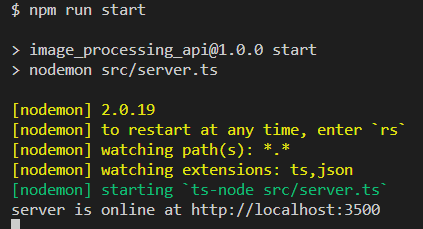

# Image Processing API

* PLEASE READ THE INSTRUCTIONS !!
* IF YOU DON'T HAVE TIME TO READ IT
* YOU CAN CHANGE THE PORT IN THE LIKES BELOW TO BE 3000 AND IT WILL BE WORK!

 - main endpoint: http://localhost:3500/
 - example for image endpoint: http://localhost:3500/image/?name=fjord&width=500&height=400


- Endpoint tests


- server running at port 3500


- 3 testes run successfully


## Description

The first project on Advanced web development at [egFWD](https://egfwd.com/) 
building an API that can be used in two different ways. As a simple placeholder API, the first allows to place images into frontend with the size set via URL parameters (and additional stylization if choosen) for rapid prototyping. The second use case is as a library to serve properly scaled versions of the images to the front end to reduce page load size. Rather than needing to resize and upload multiple copies of the same image to be used throughout your site, the API create will handle resizing and serving stored images.

## Prerequisites

You must have these installed on your machine:

- [node](https://nodejs.org/en/download/) v12 or higher.
- [npm](https://docs.npmjs.com/downloading-and-installing-node-js-and-npm) v6 or higher.

## Instructions

After downloading the project here's a couple of things you should do in order to run it:

- create .env file and set ```PORT= "3500"```
- Head to the project folder through your terminal and run these script's commands.

| todo | run | 
| :--- | :---- | 
| Compile .ts to .js | npm run build |
| Compile & jasmine test | npm run test | 
| start the server & nodemon| npm run start |
| lint| npm run lint|
| prettier| npm run prettier |

- Then open your browser and go to `http://localhost:3500/?name=fjord&width=500&height=400`

## Documentation

- Using the following format, you can provide your desired width & height of any image in `images` folder
  and a thumbnail with these dimensions will be created in `images/thumbnails`.

- http://localhost:3500/?name=fjord&width=500&height=400

- if you didn't provide any width or height, you will get an error message.

- The thumbnail will be created in the first time only, after that it will be served from the thumbnails folder directly.

- you will get `400` if there is a problem with any of the request queries and will get `404` if you asked for non existing image or there is no `images` folder.

